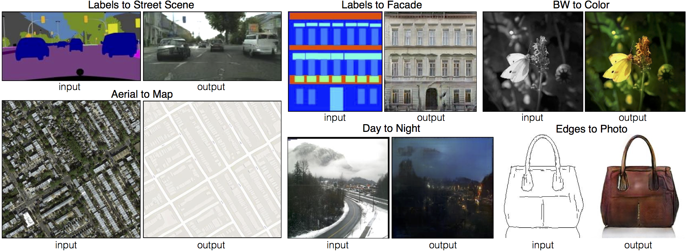

# pix2pix
Code for the paper <a href="">Image-to-Image Translation Using Conditional Adversarial Networks</a>. Learns a mapping from input images to output images, for example:



On some tasks, decent results can be obtained fairly quickly and on small datasets. For example, to learn to generate facades (example shown above), we trained on just 400 images for about 2 hours (on a single Pascal Titan X GPU).

## Setup

### Prerequisites
- Linux or OSX
- python with numpy
- NVIDIA GPU, CUDA, and CuDNN (CPU mode and CUDA without CuDNN may work with minimal modification, but untested)

### Installation
- Install torch and dependencies from https://github.com/torch/distro 
- Clone this repo:
```bash
	git clone git@github.com:phillipi/pix2pix.git
```

### Setup training and test data
We require training data in the form of pairs of images {A,B}, where A and B are two different depicitions of the same underlying scene. For example, these might be pairs {label map, photo} or {bw image, color image}. Then we can learn to translate A to B or B to A:

Create folder `/path/to/data` with subfolders `A` and `B`. `A` and `B` should each have their own subfolders `train`, `val`, `test`, etc. In `/path/to/data/A/train`, put training images in style A. In `/path/to/data/B/train`, put the corresponding images in style B. Repeat same for other data splits (`val`, `test`, etc).

Corresponding images in a pair {A,B} must have the same filename, e.g. `/path/to/data/A/train/1.jpg` is considered to correspond to `/path/to/data/B/train/1.jpg`.

Once the data is formatted this way, call:
```bash
    python data/combine_A_and_B.py --fold_A /path/to/data/A --fold_B /path/to/data/B --fold_AB /path/to/data
```

This will combine each pair of images (A,B) into a single image file, ready for training.

## Train
```bash
	DATA_ROOT=/path/to/data/ name=expt_name which_direction=AtoB th train.lua
```

Switch `AtoB` to `BtoA` to train translation in opposite direction.

Models are saved to `./checkpoints/expt_name` (can be changed by modifying `opt.checkpoint_dir` in train.lua).

See `opt` in train.lua for additional training options.

## Test
```bash
	DATA_ROOT=/path/to/data/ name=expt_name which_direction=AtoB phase=val th test.lua
```

This will run the model named `expt_name` in direction `AtoB` on all images in `/path/to/data/val`.

Result images, and a webpage to view them, are saved to `./results/expt_name` (can be changed by modifying `opt.results_dir` in test.lua).

See `opt` in test.lua for additional testing options.

## Display UI
Optionally, for displaying images during training and test, use the [display package](https://github.com/szym/display).

- Install it with: `luarocks install https://raw.githubusercontent.com/szym/display/master/display-scm-0.rockspec`
- Then start the server with: `th -ldisplay.start`
- Open this URL in your browser: [http://localhost:8000](http://localhost:8000)

By default, the server listens on localhost. Pass `0.0.0.0` to allow external connections on any interface:
```bash
    th -ldisplay.start 8000 0.0.0.0
```
Then open `http://(hostname):(port)/` in your browser to load the remote desktop.

## Example on facade generation

Let's try an example of training and testing on facade generation, using data from the <a href="http://cmp.felk.cvut.cz/~tylecr1/facade/">CMP Facades dataset</a>.

First, grab a copy of the data, already formatted for training:

```bash
    cd /path/to/data
	wget https://people.eecs.berkeley.edu/~isola/pix2pix/facades.tar
    tar -xvf facades.tar
    rm facades.tar
```

Next train:
```bash
	DATA_ROOT=/path/to/data/facades name=facades_generation which_direction=AtoB th train.lua
```

Start the display server to view results as the model trains:
```bash
	th -ldisplay.start 8000 0.0.0.0
```

Finally, test:
```bash
	DATA_ROOT=/path/to/data/facades name=facades_generation which_direction=AtoB phase=val th test.lua
```

The test results will be saved to an html file here: `/path/to/data/facades/results/facades_generation/latest_net_G_val/index.html`.


## Citation
If you use this code for your research, please cite our paper <a href="">Image-to-Image Translation Using Conditional Adversarial Networks</a>:

```
@article{pix2pix2016,
  title={Image-to-Image Translation with Conditional Adversarial Networks},
  author={Isola, Phillip and Zhu, Jun-Yan and Zhou, Tinghui and Efros, Alexei A},
  journal={arxiv},
  year={2016}
}
```

## Acknowledgments
Code borrows heavily from https://github.com/soumith/dcgan.torch

